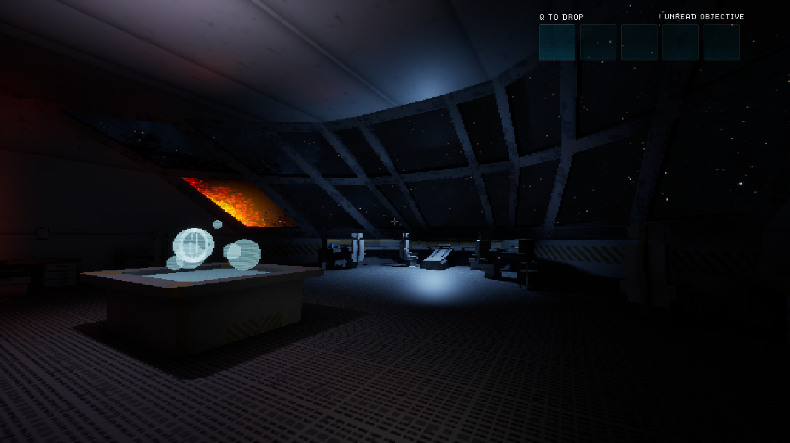

<html>
    <head>
      <meta charset="utf-8">
      <link rel="stylesheet" href="/stylesheets/main.css">
    </head>
    <body>
        <header>
            <h1>Nathan Harris</h1>
            <h2>Games Programmer/Developer</h2>
            <!--
            <ul>
                <li><a href="#">Home</a></li>
                <li><a href="#">Projects</a></li>
                <li><a href="#">Contact</a></li>
            </ul>
            -->
        </header>
        <section id="content">
            

                <!---->
                

                    <h2> About Me </h2>
                    
 Hello, I'm a 4th year student studying Computer Game Applications Development at Abertay University.   I am eager to continue my programming journey into the professional world, with a strong                                      passion for learning both new languages, or expanding my current knowledge in others. 

                

                <!---->
                

                    
 This will be a thorough breakdown of The Klein Event. 

                

                <!---->
                
                <!---->
            

            

                  <h1>Projects</h1>
                   
                  <!-- <a href="https://doctorjaffa.github.io/thekleinevent.html"> -->
                  
                  <!-- </a> -->
                   
                  <!-- <u>
<a href="https://doctorjaffa.github.io/thekleinevent.html"> The Klein Event </a>
</u> -->
            

        </section>
    </body>
</html>
